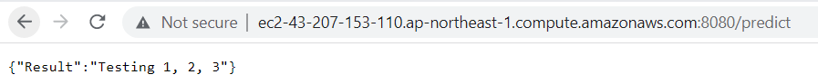
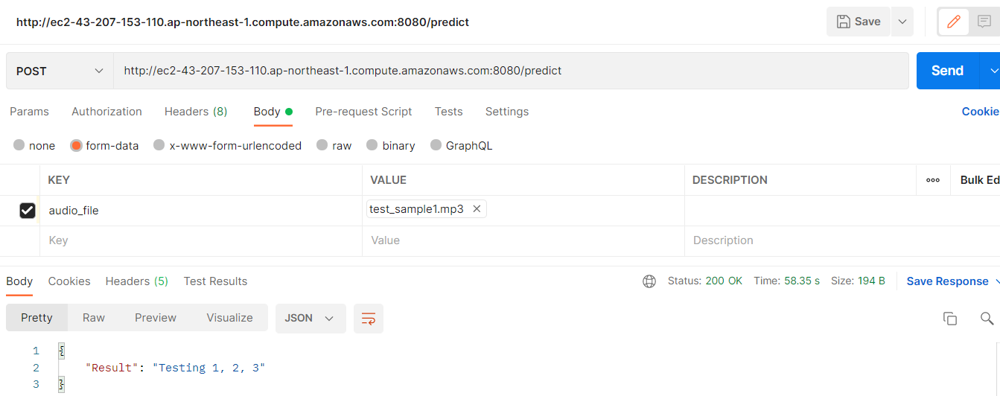

# Whisper transcription model using Flask
Whisper is a speech recognition model developed by OpenAI. It is designed to perform a wide range of tasks related to speech processing, including speech recognition, translation, and language identification. It is trained on a large dataset of audio, which allows it to have a high level of accuracy and versatility.

This project aims to deploy the open-source whisper model on AWS.
## Setup
```bash
pip install -r requirements.txt
# on Windows using Chocolatey (https://chocolatey.org/)
choco install ffmpeg
```

## Running Flask App Locally
To run the app on local machine, run the following command in the cmd
```bash
python app.py
```

## Running Flask on Webserver
The webserver is set up at (http://ec2-43-207-153-110.ap-northeast-1.compute.amazonaws.com:8080)


Upload any sound clip and click upload to send the post request. Example of result returned is shown below.


Alternatively, you can post to (http://ec2-43-207-153-110.ap-northeast-1.compute.amazonaws.com:8080/predict) using http client like postman to yield the result.

